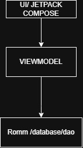

MiRecetasNan
Es una aplicacion movil que se desarrollo en Android
con el el proposito de crear una app de recetas de cocina
basados en la nueva tecnologia con el lenguaje Kotlin
y JeppackCompose.

Herramientas utilizadas 
kotlin como lenguaje.
Intefaz Grafica Jeptpack Compose (UI)
Arquitectura MVVM
Persistencia de datos ROOM Database ,Data Store
Control de Versiones Git y Github
Este proyecto se encuentras estructurado en capas con la unica
finalidad de separa responsabilidades 
Sus funciones principales fueron visualización de lista de recetas,
gestión de recetas favoritas
navegación entre pantallas.

Realizado por :Nancy t.
DIAGRAMA DE ARQUITECTURA

capturas imagenes

